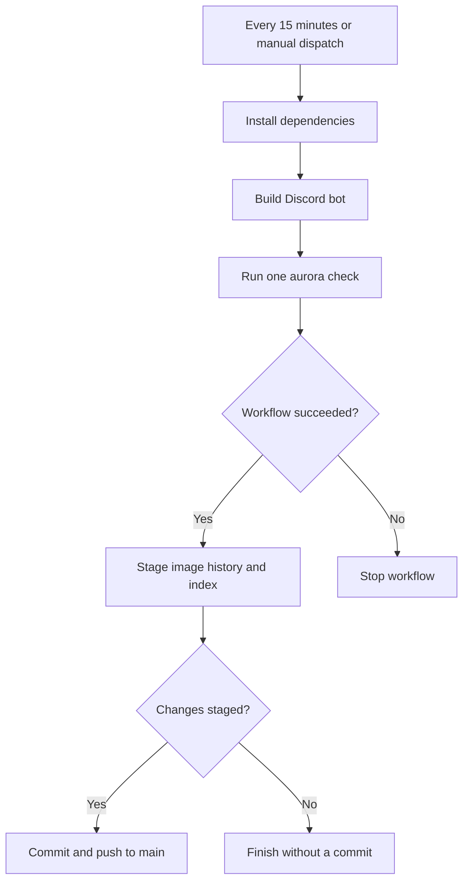
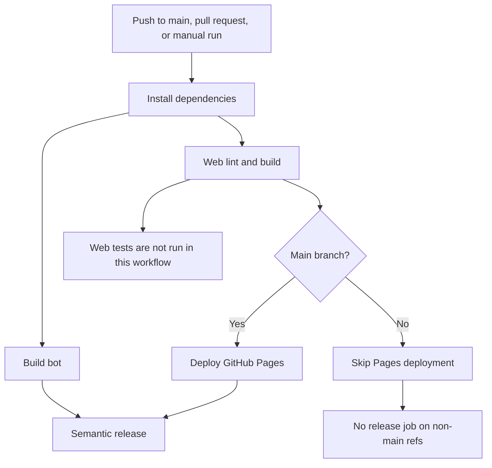

# Aurora Watcher

Aurora Watcher monitors aurora and observatory data for Finland. The repository contains a web dashboard, a Discord bot, and a local image-history admin tool.

## Repository structure

- `web/` — React and Vite dashboard, tests, and static image history.
- `bot/` — TypeScript Discord bot and image collection services.
- `admin/` — local UI and API for viewing and deleting image-history entries.
- `scripts/` — image-history maintenance and scheduled-workflow helpers.
- `.github/workflows/` — web deployment/release and scheduled bot workflows.

## Requirements and setup

Use Node.js 22 (the version used by GitHub Actions) and npm. Install dependencies from the repository root so npm installs all workspaces:

```bash
npm ci
```

## Web dashboard

```bash
npm run dev:web
npm run build:web
npm run test -w aurorawatcher-web
npm run test:e2e -w aurorawatcher-web
```

Vite serves the development app at `http://localhost:3005`. The dashboard includes observatory cameras, magnetic disturbance and solar-weather visualizations, aurora history, localization (English and Finnish), and a dark theme.

## Discord bot

Set `DISCORD_TOKEN` in the environment (or in a `bot/.env` file for local development). The bot uses channel IDs and observatory configuration defined in `bot/src/config.ts`.

```bash
npm run dev:bot
npm run build:bot
npm run start:bot
```

To register slash commands, provide both `DISCORD_TOKEN` and `CLIENT_ID`, then run:

```bash
npm run deploy -w aurorawatcher-bot
```

The bot provides `/ping`, `/status`, and `/force`. GitHub Actions also runs it in single-execution mode every 15 minutes and commits updated image history when there are changes.

## Admin tool

The admin tool reads and deletes files under `web/public/data/history` and updates `web/public/data/history_index.json`.

```bash
npm run dev:admin
```

The Vite UI runs at `http://localhost:3005`; its API listens on port `3006`. The API has no authentication and enables CORS, so use it only in a trusted local environment. See [admin/README.md](admin/README.md) for build and test commands.

## Checks and deployment

The `pipeline.yml` workflow runs web lint and build, builds the bot, deploys GitHub Pages from `main`, and runs semantic-release after the preceding jobs succeed. The web test step is currently commented out, and the workflow does not build or test the admin workspace. Run workspace tests locally when changing those areas.

The `schedule_bot.yml` workflow runs the bot every 15 minutes (and supports manual dispatch). It needs the repository secret `DISCORD_TOKEN` and repository write permission to commit collected history images.

To inspect the published site in Chromium, run `npm run test:live`. The check writes a screenshot and JSON report to `output/playwright/`; set `AURORA_WATCHER_URL` to check another deployment. See [the website improvements plan](docs/website-improvements-plan.md) for current findings and prioritized follow-up work.

### Scheduled image collection



### Build, deployment, and release


