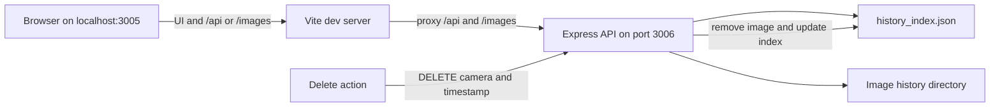

# AuroraWatcher Admin

Local UI and API for viewing observatory image history and deleting selected history entries. The API updates `web/public/data/history_index.json` and removes the corresponding file from `web/public/data`.

## Requirements and setup

Use Node.js 22 and npm. From the repository root, install all workspace dependencies:

```bash
npm ci
```

## Development

```bash
npm run dev:admin
```

This starts the Vite UI at `http://localhost:3005` and the Express API at `http://localhost:3006`. Vite proxies `/api` and `/images` requests to the API. The UI and API ports are configured in `vite.config.ts` and `server/index.ts` respectively.



## Scripts

Run these from the repository root:

```bash
npm run dev -w aurorawatcher-admin
npm run build -w aurorawatcher-admin
npm run test -w aurorawatcher-admin
```

The build creates the client bundle and compiles the TypeScript server. The admin workspace has Vitest tests for its API.

## Security

This tool has no authentication. The server enables CORS and calls `listen` without an explicit host. Keep it in a trusted local environment; do not expose the API to an untrusted network.
