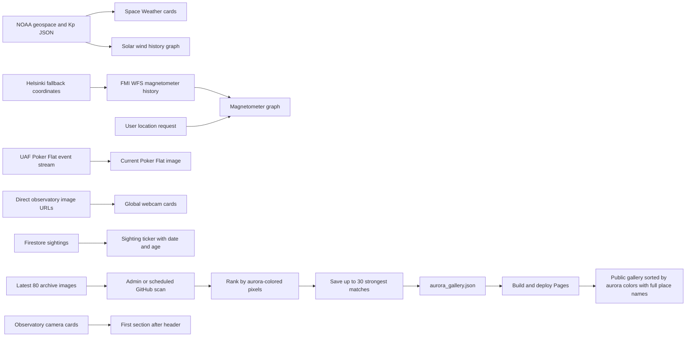

# Aurora Watcher Website Improvements

**Reviewed:** 2026-10-08
**Evidence:** Chromium inspection, `node scripts/check-live-site.mjs`, direct source checks, and local application verification. Live feeds can change independently of this repository.

## Review findings and implementation status

| Area                    | Review finding                                                                                                             | Current implementation                                                                                                                                                                                                                                         |
| ----------------------- | -------------------------------------------------------------------------------------------------------------------------- | -------------------------------------------------------------------------------------------------------------------------------------------------------------------------------------------------------------------------------------------------------------- |
| NOAA space-weather data | The old proxy returned 404 and the older solar-wind product URLs are no longer available.                                  | Uses NOAA's current geospace product and planetary K-index JSON directly. Errors, empty data, last successful update, and retry are visible in the UI.                                                                                                         |
| Magnetometer history    | No chart request was made without browser location permission; FMI also failed to fetch during the original browser check. | Requests the six-hour FMI history around Helsinki by default. The user can request a location override. Loading, empty, and error states identify FMI and offer retry. FMI delivery remains dependent on the browser's network and FMI availability.           |
| Global webcams          | The proxy broke all inspected global feeds; the Poker Flat image URL was obsolete.                                         | Uses direct image URLs for Sodankylä, Skibotn, and Kiruna. Poker Flat resolves its current image from the official UAF event stream. Failed feeds keep their names visible and show an unavailable state with retry.                                           |
| Sightings               | The ticker showed reports 7–8 months old without making staleness clear.                                                   | Each report displays its local date/time and relative age. The feed labels itself stale when the newest report is over 24 hours old and shows an explicit empty state when there are no reports.                                                               |
| Favicon                 | The HTML referenced the missing Vite starter icon.                                                                         | Removed the Vite icon reference; the shipped Aurora Watcher PWA PNG is used.                                                                                                                                                                                   |
| Section controls        | A clickable `div` did not expose expanded state or a controlled panel.                                                     | Uses a native button with `aria-expanded` and `aria-controls`; collapsed content is hidden from assistive technology and keyboard focus.                                                                                                                       |
| Aurora color gallery    | Scanning ran on the public site and saved keep lists only in each visitor's browser.                                       | Admin and the scheduled GitHub Action scan the latest 80 archive images, save up to 30 strongest matches in shared gallery data, and rank by detected aurora-colored pixels. The action builds and deploys the public gallery with full localized place names. |
| Observatory cameras     | The observatory camera section appeared below local data and the gallery.                                                  | Observatory cameras and international webcams now appear immediately after the page header.                                                                                                                                                                    |

## Data flow



## Latest improvement verification

The additional bilingual dashboard improvements from `web/designimprovements.md` are implemented in the web app. A shared five-minute NOAA snapshot supplies the header status and alert state; Space Weather uses the same snapshot. The mobile Cams/Stats/Map bar expands and scrolls to its section, the install action supports native and manual paths, and contrast mode is persisted.

The web lint and production build pass. The full unit suite passes with **189 tests across 36 files**. Chromium inspection at desktop and 390×844 mobile sizes confirmed the live NOAA status board, camera-first layout, mobile navigation and scroll to Stats, install guidance, and high-contrast rendering. The automated local Chromium check passed all 15 checks, including saved gallery ranking and full place-name display, with no console errors or failed requests. The manual local browser inspection separately showed FMI WFS timestamp-conversion and Firebase Analytics initialization errors; the dashboard remained usable and presented FMI's retry state. NOAA status data loaded successfully.

The admin scanner and ranking utility were verified against the local archive: 80 recent images scanned, one qualifying aurora-color match found and saved to `web/public/data/aurora_gallery.json`, with the place shown as Hankasalmi Observatory. The scheduled GitHub Action is configured to run the same scan and ranking every 15 minutes, keep up to 30 top matches, then build and deploy the public gallery. The workflow passes `npm run lint:actions`; the admin production build also passes.

Specific regression coverage includes solar loading/unavailable behavior, high-contrast persistence, navigation section expansion, native and fallback install flows, and swipe direction/threshold handling. Reduced-motion behavior is enforced in CSS media queries and was source-checked; no OS-level reduced-motion browser emulation was available in this browser CLI session.

## Verification

The local verification for this implementation completed on 2026-10-08:

- `npm run lint` passed.
- `npm run test` passed: 180 tests across 31 files.
- `npm run build` passed; Vite reports the existing large JavaScript chunk warning.
- Chromium check against the local Vite app passed all 14 checks. NOAA current values and the solar history graph rendered, all nine visible images loaded, the Helsinki bounding box was requested without geolocation, section controls exposed their accessible state, and the browser reported no console errors or failed HTTP requests.
- FMI returned no observations during the local browser check. The app displayed its source and retry state; a magnetometer chart could not be verified without observations.

After deployment, the public-site Chromium check also passed all 14 checks. NOAA cards/history and all nine images loaded; the Helsinki request and FMI no-observations state appeared, with no browser console errors or failed HTTP requests. FMI still supplied no observations, so a live magnetometer chart could not be verified.

Run the frontend checks from `web/`:

```bash
npm run lint
npm run test
npm run build
```

Run the browser check from the repository root:

```bash
npm run test:live
```

The browser check defaults to the published site. To inspect another deployment or a local server:

```powershell
$env:AURORA_WATCHER_URL = 'http://localhost:3005/'
node scripts/check-live-site.mjs
```

It writes a screenshot and JSON report under `output/playwright/`. It covers the dashboard, images, theme and language controls, section accessibility, Helsinki request, charts and space-weather values, FMI status, camera history, browser errors, and failed requests. A failure against the public site may reflect the deployed version or an upstream provider. Re-run it after publishing before treating a local fix as live.

## Deployment boundary

The additional dashboard improvements were pushed to `main` in commit `2f672b5b` (rebased onto release commit `517bb17c`). After publishing, `npm run test:live` passed all 14 checks against `https://krugou.github.io/aurorawatcher/` on 2026-10-08 with no browser console errors, page exceptions, failed requests, or HTTP error responses. A separate Chromium inspection at 390×844 confirmed the deployed NOAA status board, bottom Cams/Stats/Map navigation, scroll to Stats, install guidance, and high-contrast toggle. NOAA readings rendered and the Helsinki fallback request was made. FMI returned no observations during the automated check; the separate manual browser session also logged FMI timestamp-conversion and Firebase Analytics initialization errors. The FMI chart displayed its retry state, so live magnetometer observations remain dependent on upstream availability.
