# Aurora Watcher Website Improvements

**Reviewed:** 2026-10-08
**Evidence:** Chromium inspection, `node scripts/check-live-site.mjs`, direct source checks, and local application verification. Live feeds can change independently of this repository.

## Review findings and implementation status

| Area                    | Review finding                                                                                                             | Current implementation                                                                                                                                                                                                                               |
| ----------------------- | -------------------------------------------------------------------------------------------------------------------------- | ---------------------------------------------------------------------------------------------------------------------------------------------------------------------------------------------------------------------------------------------------- |
| NOAA space-weather data | The old proxy returned 404 and the older solar-wind product URLs are no longer available.                                  | Uses NOAA's current geospace product and planetary K-index JSON directly. Errors, empty data, last successful update, and retry are visible in the UI.                                                                                               |
| Magnetometer history    | No chart request was made without browser location permission; FMI also failed to fetch during the original browser check. | Requests the six-hour FMI history around Helsinki by default. The user can request a location override. Loading, empty, and error states identify FMI and offer retry. FMI delivery remains dependent on the browser's network and FMI availability. |
| Global webcams          | The proxy broke all inspected global feeds; the Poker Flat image URL was obsolete.                                         | Uses direct image URLs for Sodankylä, Skibotn, and Kiruna. Poker Flat resolves its current image from the official UAF event stream. Failed feeds keep their names visible and show an unavailable state with retry.                                 |
| Sightings               | The ticker showed reports 7–8 months old without making staleness clear.                                                   | Each report displays its local date/time and relative age. The feed labels itself stale when the newest report is over 24 hours old and shows an explicit empty state when there are no reports.                                                     |
| Favicon                 | The HTML referenced the missing Vite starter icon.                                                                         | Removed the Vite icon reference; the shipped Aurora Watcher PWA PNG is used.                                                                                                                                                                         |
| Section controls        | A clickable `div` did not expose expanded state or a controlled panel.                                                     | Uses a native button with `aria-expanded` and `aria-controls`; collapsed content is hidden from assistive technology and keyboard focus.                                                                                                             |

## Data flow

```mermaid
flowchart LR
    NOAA[NOAA geospace and Kp JSON] --> SW[Space Weather cards]
    NOAA --> SG[Solar wind history graph]
    FMI[FMI WFS magnetometer history] --> MG[Magnetometer graph]
    HEL[Helsinki fallback coordinates] --> FMI
    GEO[User location request] --> MG
    UAF[UAF Poker Flat event stream] --> PKR[Current Poker Flat image]
    CAM[Direct observatory image URLs] --> WG[Global webcam cards]
    FS[Firestore sightings] --> SF[Sighting ticker with date and age]
```



## Verification

The local verification for this implementation completed on 2026-10-08:

- `npm run lint` passed.
- `npm run test` passed: 180 tests across 31 files.
- `npm run build` passed; Vite reports the existing large JavaScript chunk warning.
- Chromium check against the local Vite app passed all 14 checks. NOAA current values and the solar history graph rendered, all nine visible images loaded, the Helsinki bounding box was requested without geolocation, section controls exposed their accessible state, and the browser reported no console errors or failed HTTP requests.
- FMI returned no observations during the local browser check. The app displayed its source and retry state; a magnetometer chart could not be verified without observations.

After deployment, the public-site Chromium check also passed all 14 checks. NOAA cards/history and all nine images loaded; the Helsinki request and FMI no-observations state appeared, with no browser console errors or failed HTTP requests. FMI still supplied no observations, so a live magnetometer chart could not be verified.

Run the frontend checks from `web/`:

```bash
npm run lint
npm run test
npm run build
```

Run the browser check from the repository root:

```bash
npm run test:live
```

The browser check defaults to the published site. To inspect another deployment or a local server:

```powershell
$env:AURORA_WATCHER_URL = 'http://localhost:3005/'
node scripts/check-live-site.mjs
```

It writes a screenshot and JSON report under `output/playwright/`. It covers the dashboard, images, theme and language controls, section accessibility, Helsinki request, charts and space-weather values, FMI status, camera history, browser errors, and failed requests. A failure against the public site may reflect the deployed version or an upstream provider. Re-run it after publishing before treating a local fix as live.

## Deployment boundary

The changes were pushed to `main`; GitHub Actions completed the web lint/build and GitHub Pages deployment, and the public-site browser check passed. The FMI WFS request returned no observations in the post-deployment check, so successful FMI data delivery and magnetometer chart rendering remain dependent on upstream availability.
